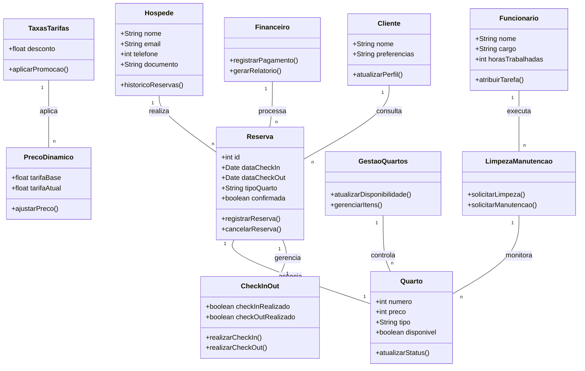

# Dicionário de Dados

| **Entidade**         | **Atributo**          | **Tipo de Dado** | **Descrição**                                          | **Chave**            |
|----------------------|-----------------------|------------------|--------------------------------------------------------|----------------------|
| **Hospede**           | nome                  | String           | Nome do hóspede                                        | Chave Primária (cpf) |
|                      | cpf                   | String           | CPF do hóspede (único)                                 | Chave Primária       |
|                      | telefone              | Int              | Número de telefone do hóspede                          |                      |
|                      | email                 | String           | E-mail do hóspede                                      |                      |
| **Reserva**           | idReserva             | Int              | Identificador único da reserva                         | Chave Primária       |
|                      | dataCheckin           | Date             | Data de entrada no hotel (check-in)                    |                      |
|                      | dataCheckout          | Date             | Data de saída do hotel (check-out)                     |                      |
|                      | status                | String           | Status da reserva (confirmada/cancelada)               |                      |
|                      | cpf (Hospede)         | String           | CPF do hóspede, chave estrangeira para **Hospede**     | Chave Estrangeira    |
| **Quarto**            | numero                | Int              | Número do quarto                                       | Chave Primária       |
|                      | tipo                  | String           | Tipo de quarto (ex: luxo, standard)                    |                      |
|                      | disponivel            | Boolean          | Status de disponibilidade do quarto                    |                      |
|                      | preco                 | Float            | Preço do quarto                                        |                      |
| **Funcionario**       | nome                  | String           | Nome do funcionário                                    | Chave Primária (cpf) |
|                      | cargo                 | String           | Cargo do funcionário                                   |                      |
|                      | cpf                   | String           | CPF do funcionário (único)                             | Chave Primária       |
|                      | telefone              | String           | Telefone do funcionário                                |                      |
| **Pagamento**         | idPagamento           | Int              | Identificador único do pagamento                       | Chave Primária       |
|                      | valor                 | Float            | Valor do pagamento                                     |                      |
|                      | metodo                | String           | Método de pagamento (cartão, boleto, etc.)             |                      |
|                      | dataPagamento         | Date             | Data do pagamento                                      |                      |
|                      | idReserva (Reserva)   | Int              | Identificador da reserva, chave estrangeira para **Reserva** | Chave Estrangeira    |
| **PrecoDinamico**     | precoBase             | Float            |
